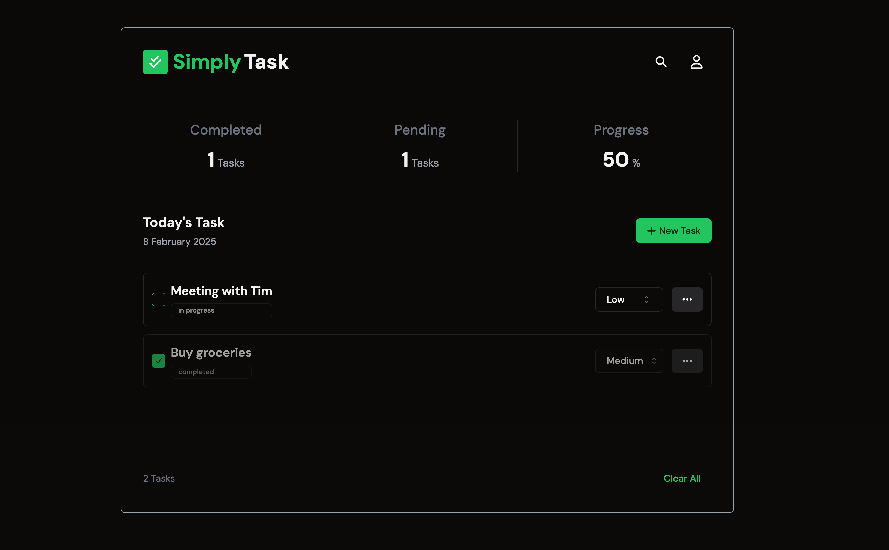
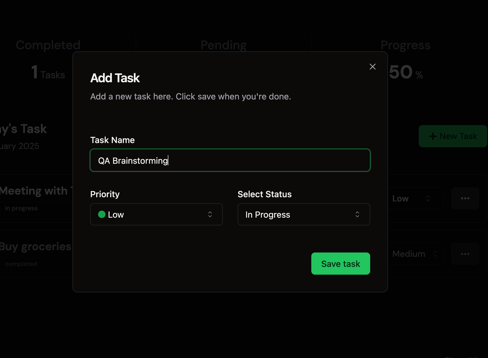
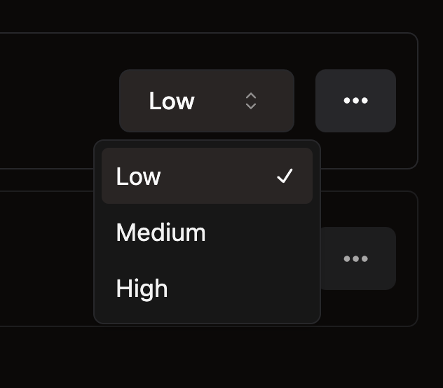
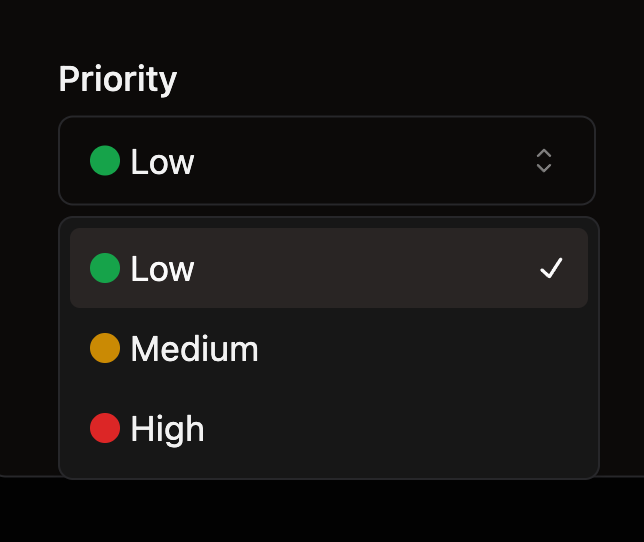
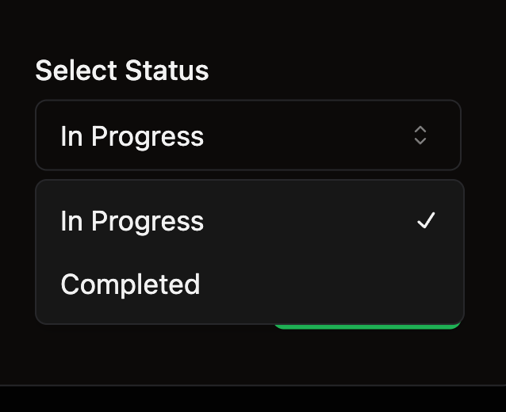

# Simple React Task App 📝



A modern task management application built with Next.js, TypeScript, and Neon DB.

[](https://nextjs.org/)
[](https://www.typescriptlang.org/)
[](https://tailwindcss.com/)
[](https://orm.drizzle.team/)
[](https://neon.tech/)



## Features 📝

- 🔐 User authentication
- 📝 Create, edit, and delete tasks
- 🏷️ Priority levels (low, medium, high)
- ✅ Task status tracking
- 📊 Task statistics dashboard
- 🌓 Light/Dark mode support
- 🔍 Search functionality
- 📱 Responsive design
- 🗑️ Clear or remove all tasks




## Tech Stack 💻

- **Framework:** Next.js 14
- **Language:** TypeScript
- **Styling:** Tailwind CSS
- **UI Components:** shadcn/ui
- **Database:** Neon DB (Serverless Postgres)
- **ORM:** Drizzle ORM
- **Authentication:** Lucia Auth
- **State Management:** Zustand
- **Form Handling:** React Hook Form + Zod
- **Icons:** Lucide React, React Icons



## Getting Started 🚀

### Prerequisites 📝

- Node.js 18+ 
- npm/yarn/pnpm
- Neon DB account

### Installation Steps 📝

1. Clone the repository:

```bash
git clone https://github.com/pakagronglb/simple-react-task-app.git
cd simple-react-task-app
```

2. Install dependencies:
```bash
npm install
```


3. Set up your Neon DB:
   - Create an account at [Neon](https://neon.tech)
   - Create a new project
   - Copy the connection string

4. Create a `.env` file in the root directory:
```bash
DATABASE_URL="your_neon_connection_string"
```

5. Initialize the database:
```bash
npm run db:generate
npm run db:push
```

6. Start the development server:
```bash
npm run dev
```

7. Open [http://localhost:3000](http://localhost:3000) with your browser.

## Project Structure 📂

- `/app` - Main application code
- `/components` - Reusable UI components
- `/hooks` - Custom React hooks
- `/lib` - Utility functions and configurations
- `/stores` - Zustand state management
- `/public` - Static assets

## Key Features Implementation 🔑

### Authentication 🔐
- Secure user authentication using Lucia Auth
- Email and password-based signup/login
- Protected routes and session management

### Task Management 📝
- CRUD operations for tasks
- Real-time status updates
- Priority level management
- Task filtering and sorting

### User Interface 🎨
- Clean and modern design using Tailwind CSS
- Responsive layout for all devices
- Dark mode support
- Toast notifications for user feedback

## Contributing 🤝

Contributions are welcome! Please feel free to submit a Pull Request.

## Credits 📚

This project was inspired by and created following the tutorial series by [Dev Script](https://www.youtube.com/@DevScript01). Check out their channel for more amazing content!

## License 📝

This project is licensed under the MIT License - see the [LICENSE](LICENSE) file for details.
